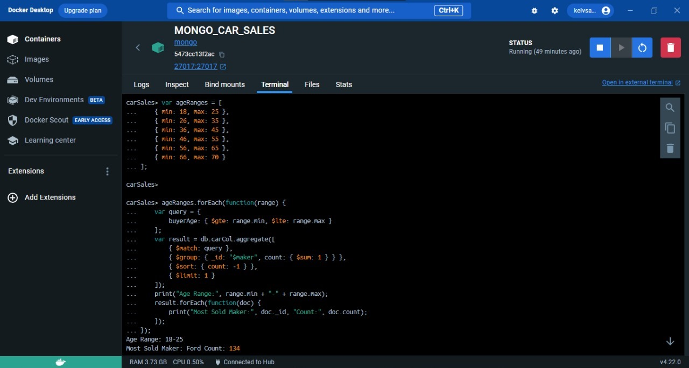
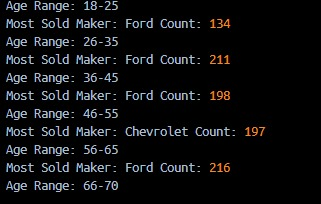

# <center>Práctica MongoDB</center>

## <center>Grupo 5</center>

---

|      Nombre      |   ID    |
| :--------------: | :-----: |
|  Donato Machado  | 1104502 |
|   Elián Matos    | 1106901 |
| John Del Rosario | 1106940 |
|   Juan Ubiera    | 1107248 |
| Kelvin Aristides | 1107646 |
| Leonel Sepúlveda | 1104995 |

1.

2.  **Vehículo Más Vendido por Rango de Edad:** Para cada rango de edad: 18-25, 26-35, 36-45, 46-
    55, 56-65, 66-70 , ¿cuál es la combinación de marca de automóvil más vendida? ¿Varía esto entre
    diferentes rangos de edad?




Comentario: Tras realizar la consulta requerida podemos ver que dependiendo de los rangos de edad
existe una marca de vehiculos que es la que mas vendida. En este caso dependiendo de la edad son:

18-25: FORD
26-35: FORD
36-45: FORD
46-55: CHEVROLET
56-65: FORD
66-70: NO HAY DATA

3.**Auto Más Popular por Rango de Precio**: ¿Cuál es la marca de automóvil más popular dentro de los
rangos de precio: 10000-25000, 25000-50000, 50000-75000 ? ¿Existen tendencias destacadas en
estas preferencias?

La consulta que arroja el resultado

```js
db.autos.aggregate([
  {
    $match: {
      salesprice: {
        $gte: 10000,
        $lte: 25000,
      },
    },
  },
  {
    $group: {
      _id: "$maker",
      count: { $sum: 1 },
    },
  },
  {
    $sort: { count: -1 },
  },
  {
    $limit: 1,
  },
]);
```

Utilizamos un match para el campo salesprice para tener los resiltados en el rango de la siguiente manera

```js

salePrice:{
                $gte: 10000,
                $lte: 25000
            }

```

seguido por una agrupacion por marca y un count que cuente los documentos por marca/provedor para saber cuantos se vendieron

```js

 _id: "$maker",
  sold: {
    $sum: 1
  }

```

Lo siguiente es hacer un sort para que el primer resultado sea el que mas ventas tiene

```js
{
  sold: -1;
}
```

Finalmente ponemos un limit para que la consulta tire un unico resultado, en este caso el mas alto que sera Ford con el campo sold dando un resultado de 202

```js
$limit: 1;
```

Ahora repetimos la consulta pero cambiando el rango de precios y tenemos los siguientes resultados:

- Para el rango de 10k a 25k el resultado es Ford con una cantidad de 202
  

- Para el rango de 25k a 50k el resultado es Ford con una cantidad de 379
  

* Para el rango de 50k a 75k el resultado es ford con con una cantidad de 346
  
  Existe una tendencia entre todos estos rangos y es que ford tiende a vender mucho

4.  **Efectividad de los Descuentos: ¿Puedes determinar si ofrecer descuentos más altos lleva a un
    aumento en el volumen de ventas o en los ingresos? ¿Existe un punto de rendimientos decrecientes?** \* **La siguiente captura muestra la consulta del volumen de ventas en función de los descuentos:**

        

        Al observar estos resultados, se puede notar una relación general entre los descuentos más altos y un aumento en el volumen total de ventas (totalSales). Sin embargo, también podemos ver cómo los ingresos totales (totalPrice) varían para diferentes niveles de descuento.

    Se observa en muchos casos que ofrecer descuentos más altos sí está relacionado con un aumento en el volumen de ventas, pero también puede haber un impacto en los ingresos totales. A medida que los descuentos aumentan, el volumen de ventas tiende a aumentar, pero los ingresos totales pueden no aumentar en la misma proporción debido a los descuentos. Esto podría indicar que, aunque los descuentos aumentan las ventas, también pueden reducir la rentabilidad debido a la reducción de los precios de venta.

    - **La siguiente captura muestra la consulta con el objetivo de identificar si existen rendimiento decrecientes:**

    

    

    Basado en los resultados de la consulta, parece que hay una serie de valores negativos en las diferencias de ingresos entre niveles de descuento consecutivos. Esto podría indicar que después de cierto punto, un aumento adicional en los descuentos está llevando a una disminución en los ingresos totales generados por las ventas. Los resultados sugieren que podría haber un punto de rendimientos decrecientes después del cual los ingresos adicionales generados por los descuentos disminuyen.

5.## Punto 5

**Patrones de Compra Basados en Género**: ¿Existen tendencias basadas en el género en las compras,
como colores, marcas o tipos de automóviles específicos que son preferidos por un género sobre el
otro?

Con la siguiente consulta podemos ver segun el genero que color tienden a comprar las personas segun su genero:

```js
db.autos.aggregate([
  {
    $group: {
      _id: {
        gender: "$gender",
        color: "$color",
      },
      count: { $sum: 1 },
    },
  },
  {
    $sort: { "_id.gender": 1, count: -1 },
  },
  {
    $group: {
      _id: "$_id.gender",
      mostCommonColor: { $first: "$_id.color" },
      count: { $first: "$count" },
    },
  },
]);
```

Primero agrupamos por genero y color donde id es un objeto que contiene el genero de la persona y el color del carro que compraron y el count es cuantos registros hay por grupo

Els siguiente paso es utilizar un sort para ordenar los grupos por genero en orden ascedente en cuanto al genero y en orden descendente en cuanto al count

Luego hacemos otro group por genero donde se selecciona el color mas comun.

Esta consulta nos arroja los siguientes resultados:

- Las personas que se identifican como GenderFluid tienden a comprar carros de color Aquamarine
- Las personas que se identifican como Agender tienden a comprar carros de color Turquoise
- Las personas que se identifican como Male tienden a comprar carros de color Teal
- Las personas que se identifican como Non-binary tienden a comprar carros de color Khaki
- Las personas que se identifcan como Genderqueer tienden a comprar carros de color crimson
- Las personas que se identifican como Female tienden a comprar carros de color Goldenrod
- Las personas que se identifican como Polygender tienden a comprar carros de color Purple
- Las personas que se identifcan como Bigender tienden a comprar carros de color Red


Con la siguiente consulta podemos ver cual Maker tiende a vender mas segun genero

```js
db.autos.aggregate([
  {
    $group: {
      _id: {
        gender: "$gender",
        maker: "$maker",
      },
      count: { $sum: 1 },
    },
  },
  {
    $sort: { "_id.gender": 1, count: -1 },
  },
  {
    $group: {
      _id: "$_id.gender",
      mostCommonMaker: { $first: "$_id.maker" },
      count: { $first: "$count" },
    },
  },
]);
```

Primero tenemos un group donde el id de nuevo es un objeto que contiene al gender y al Maker y tenemos un count que cuenta los registos

Luego tenemos un sort donde se ordena por genero y luego de forma ascendente y luego por el count de manera descendente.

Finalmente tenemos otro group que agrupa por genero y selecciona al maker mas comun por genero.

Esto nos arroja los siguientes resultados:

- Las personas que se identifican como Genderfluid, Male, Non-binary, Female, y Polygender tienden a comprar carros Ford
- Las personas que se identifican como Agender, Genderqueer y Bigender suelen comprar carros Chevrolet


6. **Análisis Estacional: ¿Cómo varían las ventas de automóviles a lo largo de diferentes estaciones? ¿Existen tipos de autos más atractivos durante momentos específicos del año?**

Variación de las ventas de automoviles según las estaciones:


Los datos muestran que las ventas de automóviles varían ligeramente a lo largo de las estaciones, con una cierta estabilidad en las ventas en otoño, un aumento sorprendente en verano y un patrón de crecimiento gradual desde la primavera hasta el otoño. Estos hallazgos podrían estar influenciados por factores como las promociones estacionales, las condiciones climáticas, las preferencias de compra y las dinámicas del mercado automotriz.

**Tipos de autos más atractivos durante momentos específicos del año:**


**Invierno:** Durante el invierno, el color más atractivo en términos de ventas es el verde, y el fabricante más popular es Volkswagen. Esto podría sugerir que en invierno los compradores están buscando autos con colores más frescos y naturales.

**Primavera:** En primavera, el color más atractivo es el amarillo, y el fabricante más popular es Plymouth. Esto podría indicar que en la primavera los compradores prefieren autos con colores brillantes y llamativos.

**Otoño:** Durante el otoño, el color más atractivo es el carmesí (Crimson), y el fabricante más popular es Mercedes-Benz. Esto podría señalar que en otoño los compradores están interesados en colores más cálidos y elegantes.

**Verano:** En verano, el color más atractivo es el dorado (Goldenrod), y el fabricante más popular es GMC. Esto podría indicar que en verano los compradores optan por colores que reflejen el ambiente soleado y cálido.

7.

8. **Demografía del Comprador para Autos Nuevos vs. Usados: ¿Atraen los autos nuevos y usados a diferentes demografías? ¿Existen ciertos grupos de edad o géneros más inclinados a comprar autos nuevos o usados?**
   Las siguientes capturas demuestran que los mínimos y máximos entre los autos usados y nuevos son los mismos, sugiriendo que en este caso, el estado de uso del auto no atrae diferentes demografías.<br>

   - Autos nuevos
     
     
   - Autos usados
     
     

   ***

   Con las siguientes capturas de pantalla se evidencia que las cantidades de carros nuevos y usados de cada grupo de edades (divididos en intervalos de 10 años) son muy similares. No se encuentran variaciones notables en las cantidades de compra en los diferentes grupos de edades.<br>
   
   

9. **Distribución de Precios por Marca de Auto: ¿Cuál es la distribución de los precios de venta para cada
   marca de automóvil? ¿Existen marcas de lujo con precios consistentemente más altos en comparación
   con otras?**

**Distrubución de precios para cada marca de automóvil:**


Los resultados muestran la distribución de precios de venta para cada marca de automóvil y nos permiten identificar si hay marcas de lujo con precios consistentemente más altos en comparación con otras marcas.

Marcas con Precios Altos: Hay marcas que tienen precios consistentemente más altos en comparación con otras. Algunas marcas como "Peugeot", "Jensen", "MG", "Corbin", "Merkur", "McLaren", entre otras, tienen precios promedio bastante altos en comparación con la mayoría de las marcas.

10. **Correlación entre Edad del Comprador y Color del Auto: ¿Existe alguna correlación entre la edad del comprador y el color del automóvil que compran? ¿Los compradores más jóvenes prefieren ciertos colores sobre otros?**<br>
    En este caso, primero listé todos los colores que existen en la base de datos y tomé el promedio de edades que compran cada color. En los resultados de la consulta se puede ver que la diferencia de edades relacionados con el color es mínima y se mantiene alrededor de 42 años.

    
    <br>
    Además se puede observar que la cantidad de compras agrupadas por el color no varían significativamente. El único color que llega a las 600 ventas es el rojo.

    

    <br>
    Cuando revisamos las edades máximas y mínimas de cada color, vemos que los colores son comprados por todas las edades por igual, la edad máxima es de 65 y la edad mínima son 20 años.

    
